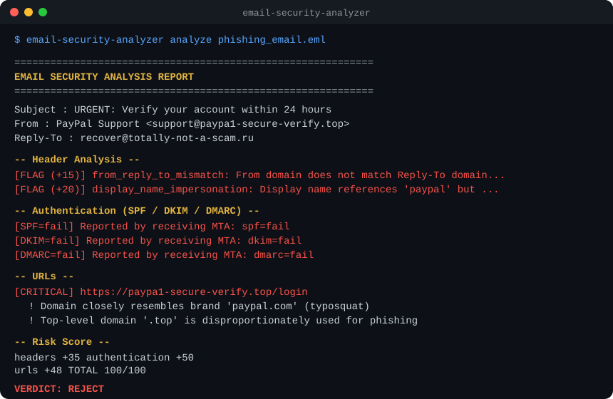

# Email Security Analyzer

[](https://github.com/thecybersecbeast/email-security-analyzer/actions/workflows/ci.yml)
[](LICENSE)
[](pyproject.toml)

A detection engine for suspicious, fraudulent, and malicious emails —
inspired by the same layered approach real secure-email gateways use.

It parses `.eml` messages — either one-off via `analyze`, or continuously
in real time via `watch` (Maildir folder or IMAP mailbox) — and evaluates
them across five detection categories plus an optional sender domain-age
check, combining every signal into a single weighted **risk score** and a
**deliver / quarantine / reject** verdict.

```
Internet
   │
   ▼
Mail Server (.eml)
   │
   ▼
EmailAnalyzer
   │
 ┌─┼──────────┬──────────┬───────────┐
 ▼ ▼          ▼          ▼           ▼
Headers   SPF/DKIM/DMARC  Attachments  URLs + Phishing content
   │
   ▼
Risk Score (0-100)
   │
   ▼
Deliver / Quarantine / Reject
```



## Detection categories

| Module           | What it checks                                                                                                                                                    |
| ---------------- | ----------------------------------------------------------------------------------------------------------------------------------------------------------------- |
| `headers.py`     | From/Reply-To/Return-Path mismatches, brand-impersonating display names, missing/forged Received chain, Message-ID sanity, Date sanity                            |
| `auth.py`        | SPF / DKIM / DMARC results (parsed from `Authentication-Results`, with an optional live SPF DNS lookup)                                                           |
| `attachments.py` | SHA-256/MD5 hashing, dangerous extensions (`.exe`, `.js`, `.lnk`, ...), double-extension tricks (`invoice.pdf.exe`), embedded VBA macro detection in Office files |
| `urls.py`        | IP-literal URLs, punycode/homograph domains, URL shorteners, `@`-redirection tricks, fuzzy brand typosquat detection (`micr0soft-support-login.com`), and abused-TLD flagging (`.zip`, `.top`, `.tk`, ...)          |
| `phishing.py`    | Urgency language, credential-harvesting phrasing, financial/gift-card lure bait, generic mass-mail greetings                                                                                     |
| `reputation.py`  | Sender domain age via WHOIS (optional, off by default — a domain registered hours before it starts sending mail is a strong phishing signal)                      |

All findings feed into `scoring.py`, which sums weighted points per
category (capped at 100) and maps the total to a verdict:

| Score  | Verdict    |
| ------ | ---------- |
| 0–39   | Deliver    |
| 40–69  | Quarantine |
| 70–100 | Reject     |

Thresholds and weights are constants at the top of `scoring.py` — tune
them to your own risk appetite.

## Installation

```bash
git clone https://github.com/thecybersecbeast/email-security-analyzer.git
cd email-security-analyzer
pip install -e ".[dev]"
```

Optional extras:
- `dns` — a supplementary live SPF DNS lookup (`pip install -e ".[dns]"`),
  used only as a fallback when a message has no `Authentication-Results`
  header.
- `whois` — enables the sender domain-age check (`pip install -e ".[whois]"`),
  used by `analyze --check-domain-age`.
- `imap` — enables true push-based IMAP IDLE monitoring
  (`pip install -e ".[imap]"`), used by `watch --idle`. IMAP polling mode
  needs no extra dependency.

Copy `.env.example` to `.env` if you're testing the IMAP watcher locally.

### Docker

```bash
docker build -t email-security-analyzer .
docker run --rm -v "$PWD/samples:/samples" email-security-analyzer \
  analyze /samples/message.eml
```

Or via Compose (see `docker-compose.yml` for all targets):

```bash
docker compose run --rm analyze samples/message.eml
docker compose run --rm watch-maildir
```

## Usage

### CLI

```bash
# Analyze a single message
email-security-analyzer analyze path/to/message.eml

# Analyze every .eml file in a directory
email-security-analyzer analyze ./samples/

# Machine-readable JSON output
email-security-analyzer analyze message.eml --json

# Also factor in sender domain age (requires network + the 'whois' extra)
email-security-analyzer analyze message.eml --check-domain-age

# Use as a CI/CD gate: exit 1 if any sample is scored REJECT
email-security-analyzer analyze ./samples/ --fail-on-reject

# Verbose (debug-level) logging for any subcommand
email-security-analyzer -v analyze ./samples/
```

### Real-time monitoring

`watch` continuously monitors for new mail and analyzes each message the
moment it arrives — no need to run `analyze` by hand. Two sources:

**Maildir folder** — watches a `Maildir/new/` directory (the format used
by Postfix, Dovecot, and most \*nix mail servers) and files each processed
message into a sibling `cur/`, `quarantine/`, or `rejected/` directory
based on its verdict:

```bash
email-security-analyzer watch --maildir /var/mail/vhost/example.com/new
```

**IMAP mailbox** — watches any IMAP account (Gmail, Outlook, self-hosted)
and moves QUARANTINE/REJECT messages into `Quarantine`/`Rejected` folders:

```bash
export EMAIL_ANALYZER_IMAP_PASSWORD="your-app-password"
email-security-analyzer watch \
  --imap-host imap.gmail.com \
  --imap-user you@gmail.com \
  --imap-mailbox INBOX
```

By default this polls every 10 seconds (`--poll-interval` to change it) —
no extra dependency required. For genuine push-based, zero-delay
notification, add `--idle` (requires `pip install -e ".[imap]"`):

```bash
email-security-analyzer watch --imap-host imap.gmail.com --imap-user you@gmail.com --idle
```

> Never pass a password on the command line. `--imap-password-env` names
> an environment variable to read it from (default:
> `EMAIL_ANALYZER_IMAP_PASSWORD`). For Gmail/Outlook you'll need an
> [app password](https://support.google.com/accounts/answer/185833) since
> they don't allow plain IMAP login with your normal password.

Both watch modes are also usable as a library for embedding in a larger
pipeline:

```python
from email_security_analyzer import EmailAnalyzer
from email_security_analyzer.realtime import watch_maildir

for path, result in watch_maildir("/var/mail/vhost/example.com/new", analyzer=EmailAnalyzer()):
    print(path, result.risk.verdict, result.risk.total)
```

### Library

```python
from email_security_analyzer import EmailAnalyzer
from email_security_analyzer.report import to_text

analyzer = EmailAnalyzer()
result = analyzer.analyze_file("message.eml")

print(result.risk.verdict, result.risk.total)
print(to_text(result))
```

Pass `EmailAnalyzer(check_domain_age=True)` to enable the WHOIS domain-age
signal from the library too (requires the `whois` extra + network access;
degrades to a no-op otherwise).

## Example output

```
============================================================
EMAIL SECURITY ANALYSIS REPORT
============================================================
Subject   : URGENT: Verify your account within 24 hours
From      : PayPal Support <support@paypa1-secure-verify.com>
Reply-To  : recover@totally-not-a-scam.ru

-- Header Analysis --
  [FLAG (+15)] from_reply_to_mismatch: From domain does not match Reply-To domain...
  [FLAG (+20)] display_name_impersonation: Display name references 'paypal' but ...

-- Authentication (SPF / DKIM / DMARC) --
  [SPF=fail] Reported by receiving MTA: spf=fail
  [DKIM=fail] Reported by receiving MTA: dkim=fail
  [DMARC=fail] Reported by receiving MTA: dmarc=fail

-- Attachments --
  invoice.pdf.exe (55 bytes, sha256=e90f9df1d948c274...)
      ! Extension '.exe' is a common malware delivery format.
      ! Filename uses a double extension ...

-- Risk Score --
  headers              +60
  authentication       +50
  attachments          +75
  phishing_content     +40
  TOTAL                100/100

VERDICT: REJECT
============================================================
```

## Development

```bash
pip install -e ".[dev,dns,whois,imap]"
ruff check src tests      # lint
mypy src                  # type-check
pytest                    # tests + coverage
```

Pinned versions for the `dev`+`dns`+`whois`+`imap` extras live in
`requirements.lock` (regenerate with `pip-compile pyproject.toml --extra
dev --extra dns --extra whois --extra imap --generate-hashes -o
requirements.lock` after bumping a dependency). Dependabot opens weekly
PRs for both pip and GitHub Actions updates.

Test fixtures live in `tests/fixtures/` and include a clean email, a
phishing email (failed auth, typosquatted URL, disguised executable
attachment, urgency/credential-harvesting language), and a macro-laced
Office document — all synthetic, containing no real malware.

See [CONTRIBUTING.md](CONTRIBUTING.md) for the full setup/PR workflow and
[CHANGELOG.md](CHANGELOG.md) for release history.

## CI/CD

`.github/workflows/ci.yml` runs on every push and PR:
lint (ruff) → type-check (mypy) → test with coverage (pytest, Python
3.10–3.12) → dependency audit (pip-audit against `requirements.lock`) →
a separate build job producing sdist/wheel artifacts.

## Design notes & limitations

- **SPF/DKIM/DMARC**: trusts the `Authentication-Results` header stamped
  by the receiving MTA, since that reflects verification against the
  true connecting IP — something that can't be reconstructed reliably
  after the fact. The optional live SPF check is a simplified
  supplementary signal, not a full RFC 7208 implementation.
- **Macro detection**: structural (looks for an embedded `vbaProject.bin`
  inside the Office ZIP container), not full VBA static/behavioral
  analysis.
- **Domain-age check**: off by default (`--check-domain-age` /
  `EmailAnalyzer(check_domain_age=True)`) since it needs network access
  and the `whois` extra; always degrades to "unknown" (zero weight)
  rather than failing the analysis if either is unavailable.
- **No sandboxing/AV/YARA integration**: this project focuses on
  fast, dependency-light static and heuristic analysis. It's designed
  to be extended — plug in a sandbox detonation service or a hash lookup
  against a threat-intel feed as an additional weighted signal in
  `scoring.py`.
- **Brand/typosquat lists** in `headers.py` and `urls.py` are small
  starter sets — swap in your organization's real brand list for
  production use.

## License

MIT — see [LICENSE](LICENSE).
